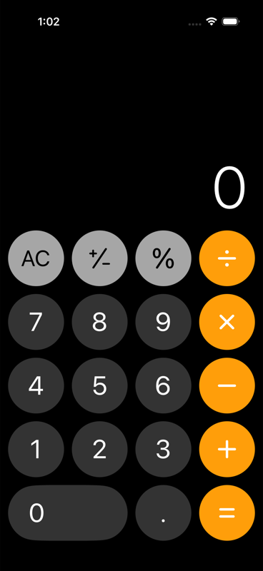
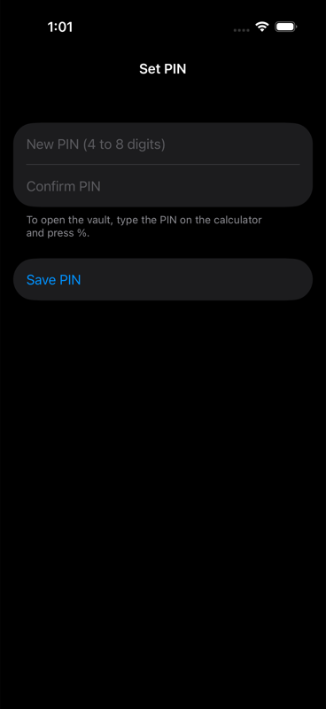

# CalculatorVault

A native iOS calculator with a hidden photo and video vault.
SwiftUI, iOS 17+, Xcode 16+.

Type the PIN on the calculator and press `%` to open the vault.

## Screenshots

## Install

TestFlight: internal testers only. There is no public link yet.

Build from source:

1. Open `CalculatorVault.xcodeproj` in Xcode 16 or later.
2. Run the `CalculatorVault` scheme on an iPhone with iOS 17 or later, or on a simulator.

## Open the vault

1. On the first launch, the app shows the **Set PIN** screen. Enter a PIN of 4 to 8 digits and confirm it.
   The first digit must not be 0, because the calculator drops leading zeros.
2. To open the vault, type the PIN and press `%`. With a wrong PIN, `%` works as the percent operator.
3. To lock the vault, tap the lock button. The vault also locks when the app goes to the background,
   or after 60 seconds with no touch.
4. To change the PIN, open the vault, tap the `...` menu, tap **Settings**, and tap **Change PIN**.

There is no PIN recovery. If you forget the PIN, the vault files are lost.

## Threat model

The app protects the vault files and the master key.

The app protects against:

- a person who holds the unlocked phone and does not know the PIN,
- a person who looks at the app switcher,
- a person who reads the app files on a locked device,
- a person who reads the iCloud backup.

The app does not protect against:

- a person with the unlocked phone who finds the app on the home screen.
  The app looks like a calculator, but it does not hide that it exists.
- a person who extracts the Keychain item and tries PINs offline. A 4-digit PIN has 10 000 values.
- malware or a jailbroken device. Decrypted data is in memory while the vault is open.

A hidden vault is not a substitute for the device passcode and iOS data protection.
The share copy in `tmp/share/` is plaintext until the next lock.

Use a device passcode, a long PIN, and Advanced Data Protection on the iCloud account.

## Security design

The app makes one random 256-bit master key. The PIN wraps the master key.
The app encrypts each file under the master key. The app never stores the PIN.

Code: `CalculatorVault/Security/` holds the PIN and Keychain code.
`CalculatorVault/Storage/` holds the encryption and file code.

### Key management

- The app derives a key from the PIN with PBKDF2-HMAC-SHA256, 200 000 rounds, and a random 16-byte salt.
- The app wraps the master key with AES-256-GCM under the derived key.
- The Keychain item holds a version byte, the salt, and the wrapped master key.
- A wrong PIN fails the AES-GCM tag check. Each try costs about 0.2 s.
- Change PIN wraps the same master key under the new PIN. The vault files do not change.

### File format

- Header: the magic `CVLT`, the plaintext length (UInt64), and an 8-byte nonce prefix.
- Chunks: up to 1 MiB of plaintext each, encrypted with AES-256-GCM, followed by a 16-byte tag.
- The nonce of a chunk is the prefix plus the chunk index.
- The header is the additional authenticated data of every chunk.
- The app writes to a hidden `.part` file and renames it when the write completes.
  The file keeps its extension.

### Data at rest and in memory

- Import uses the system `PhotosPicker`. The app does not request access to the photo library.
- The vault files are in `Application Support/Vault/`. The directory and every file use `NSFileProtectionComplete`.
- The app writes no plaintext copy. Thumbnails and photos come from ImageIO on decrypted data in memory.
  Videos play through an `AVAssetResourceLoader` delegate that decrypts byte ranges on demand.
- Share is the one exception. It decrypts the item to `tmp/share/`. The app deletes that copy at the next lock.

### Lock behavior

The vault locks when you tap the lock button, when the app goes to the background,
and after 60 seconds with no touch. A running video does not count as a touch.
When the app becomes inactive, a calculator view covers the window, so the app switcher does not show the vault.
At the lock, the app clears the master key and empties the in-memory cache of thumbnails and previews.

### Backup, restore, and reinstall

- The iCloud device backup includes the vault files and the Keychain item. The app needs no entitlement.
- The backup holds only ciphertext, the salt, and the wrapped master key.
- After a restore on a new device, type the same PIN and press `%`.
- Advanced Data Protection on the iCloud account makes the backup end-to-end encrypted.
- The Keychain survives a reinstall. The app clears the old item on the first launch after an install,
  so the Set PIN screen shows again. It keeps the item when the vault directory exists, because that is a restore.

## Project layout

- `CalculatorVault/Calculator/` — calculator engine and view.
- `CalculatorVault/Vault/` — gallery grid, settings page, and full-screen viewer.
- `CalculatorVault/Security/` — Keychain PIN store and PIN setup form.
- `CalculatorVault/Storage/` — vault directory, encryption, import, delete, thumbnails, video loader.

## Contributing

- Open an issue before you start a large change.
- Build the app as described in [Install](#install).
- Open a pull request against `main`.

## Report a security issue

Do not open a public issue for a vulnerability.
Use **Report a vulnerability** on the Security tab of this repository.
Include the iOS version, the steps, and the impact. You get a reply within 14 days.
There is no bug bounty.

## License

GPL-3.0, see `LICENSE`.
